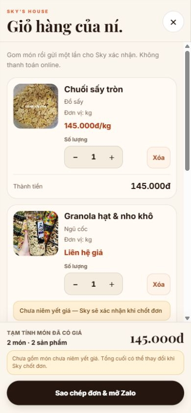

# CART-UX-001 — Validation evidence

Date: 2026-10-02. Owner: Sky. Branch: `task/cart-ux-001`.
Base/main verified: `f228de79aa40885e535bd76e216183e1e957eed2` (PR #39 merged).

## Scope and data

Local app at `http://127.0.0.1:5178/`, connected to the existing public SkyHouse catalog. Used existing products **Chuối sấy tròn** (145,000 VND/kg) and **Granola hạt & nho khô** (unpriced). Cart entries were added through the normal product modal. Customer fields remained empty. No fake catalog/customer data, order RPC, CTA submission, external Zalo launch or production write was used.

## Build and source review

- `npm run build`: passed (Vite 6.4.3, 496 modules).
- `npx --no-install tsc --noEmit --types vite/client`: passed.
- `git diff --check`: passed.
- No test script is configured in package.json; interaction checks below cover the changed presentation.
- Existing bundle warning over 500 kB remains (JS 605.62 kB / gzip 178.80 kB).
- Independent source review found no actionable regression. Raw `.cartItemMain > span` price, first name/category nodes, quantity and `.cartTotal b` contracts remain available to the order snapshot parser. Submission/validation/persistence logic was not rewritten.

## Observed local UI checks

| Viewport | Image | Quantity controls | Scroll region | Horizontal overflow | CTA visible |
| --- | --- | --- | --- | --- | --- |
| 320×640 | 88 px | 44×44 px | cartBody only | None | Yes |
| 375×667 | 92 px | 44×44 px | cartBody only | None | Yes |
| 390×844 | 92 px | 44×44 px | cartBody only | None | Yes |
| 414×896 | 92 px | 44×44 px | cartBody only | None | Yes |
| 390×500 | 92 px | 44×44 px | cartBody only | None | Yes |
| 1280×800 | 96 px | 44×44 px | cartBody only | None | Yes |

Item removal target measured 48×44 px. Customer form count stayed one after quantity changes and settled close/reopen/reload. Focusing customer inputs at 320×640 scrolled the content to the form; the summary/CTA stayed pinned. Background overflow was hidden while the cart was open and restored to visible after close. Captured browser error/warning log was empty.

- Mixed cart: one priced item + one unpriced item → `2 món · 2 sản phẩm`, known subtotal `145.000đ`; unknown item total `Chờ xác nhận` with exact requested notice.
- Increment known quantity 1→2 → item/subtotal `290.000đ`, `3 món · 2 sản phẩm`; unknown quantity unchanged.
- Decrement known quantity to zero removed it; all-unpriced cart showed `Chờ chốt giá`, not a misleading numeric zero.
- Removing the remaining item produced the empty-cart view and removed checkout/form.
- Quantity reached 99 via normal controls; plus became disabled; known total `14.355.000đ`.
- Refilled mixed cart persisted through reload and close/reopen, with one customer form.

## Visual evidence and acceptance boundary

Agent inspected the following actual browser screenshots:

- [390×844 mixed cart](mobile-390.jpg)
- [320×640 narrow cart](mobile-320.jpg)
- [320×640 customer form scroll position](mobile-320-form.jpg)

Local UI/build checks are verified. **Sky visual acceptance remains pending.** Browser viewport checks do not establish physical-phone keyboard behavior or production acceptance. No production deployment or merge performed. Stop at Owner merge gate; after explicit merge instruction, verify deployment and production mobile layout.
